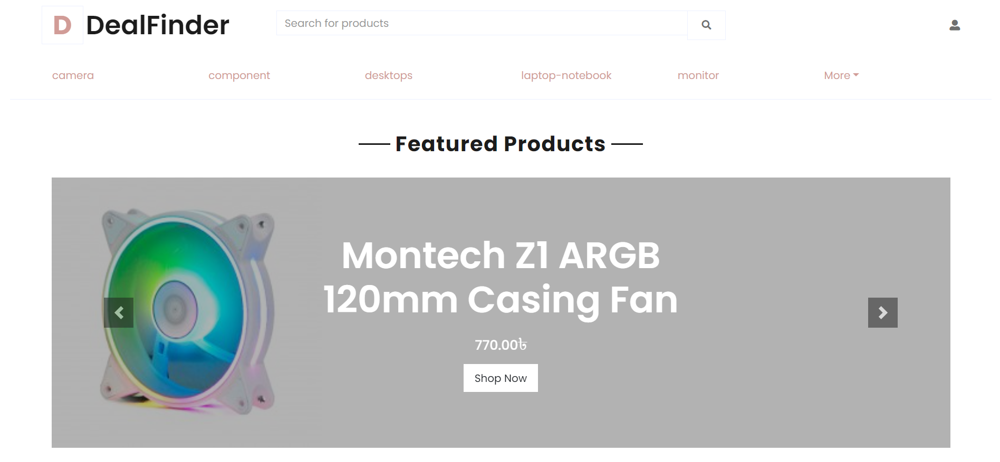
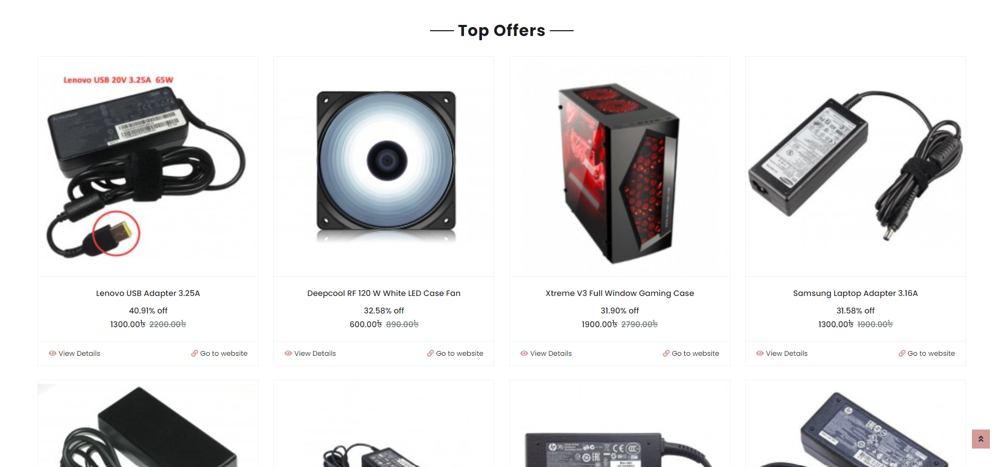
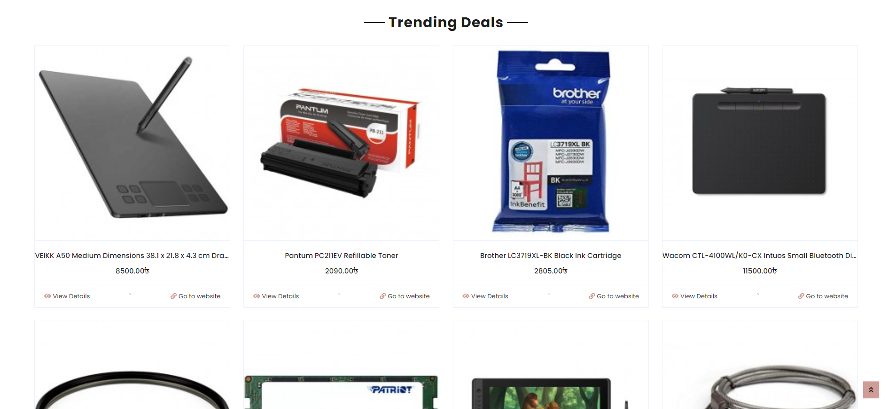
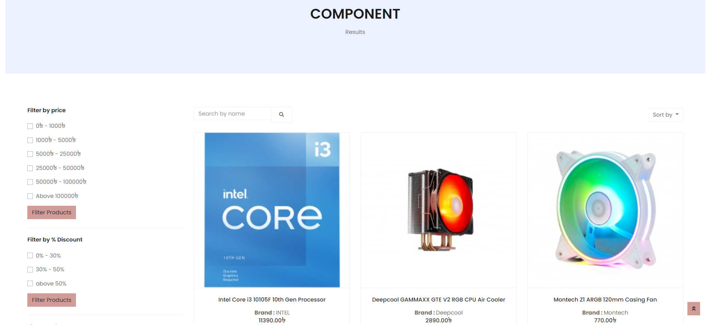
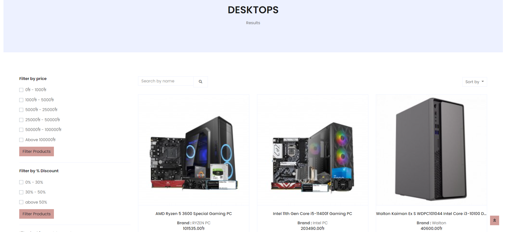
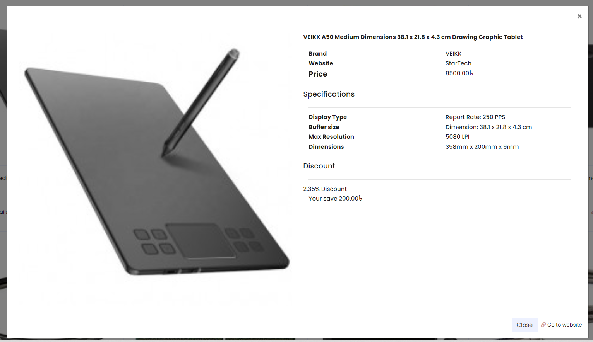

# **`DealFinder`**
 
 ***Dealfinder*** is a platform for users to access and stay informed about all the latest technology deals and promotions. 

[Short Demo](https://drive.google.com/file/d/1gxL3_7CI0p0CYd5voHFJD7Pzb6HVjlxX/view?usp=sharing)

# **System Design**

- [Scope Fixation](System%20Design/01-Scope%20Fixation%20of%20Deal%20Finder.pptx)
- [BPMN](System%20Design/02-BMPN.pptx)
- [Mock UI](System%20Design/03-Mock%20UI.pptx)
- [Class and ER Diagram](System%20Design/04-Class%20and%20ER%20Diagram.pptx)
- [Collaboration Diagram](System%20Design/05-Collaboration%20Diagram.pdf)
- [Sequence Diagram](System%20Design/06-Sequence%20Diagram.pdf)

# **Scraper**

A scraper module was implemented to scrap product information from existing sites to prepopulate data. The implementation can be found [here](scraper/)

# **Demo Module**

A demo module was implemented as a proof of concept.

## *Home*

## *Top Offers*

## *Trending Deals*

## *Products*

